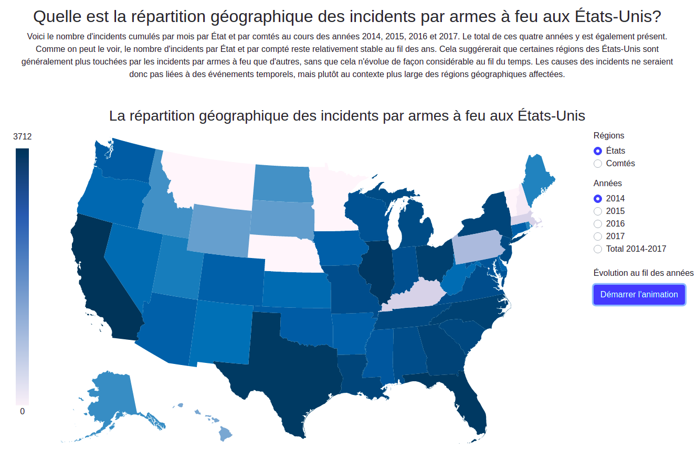

# Installation
 ```bash
  npm install
  ng serve -o
```

# Project
<p>This project was done during a DataVisualisation course to demonstrate gun incidents in the USA. The website provides an interactive map in which the user can interact with and see gun incidents by states, counties and years.</p>

# Demo
The website is hosted by heroky : <a href="https://usagunincidents.herokuapp.com">Web site link</a>


